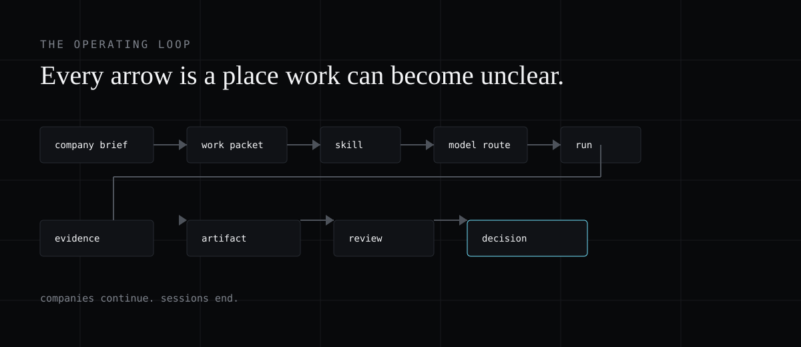
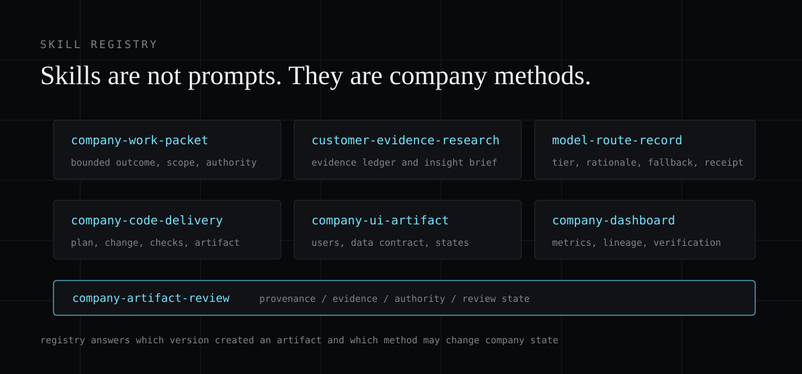

# Company Foundry

> Compile one company brief into scoped work, skills, routes, evidence, artifacts, and reviews.


Company Foundry is a portable operating-method registry for AI-native companies. It does not pretend that an agent is a company. It makes each important job explicit: why the work exists, what it may read, what it may change, which model tier fits, what artifact it must produce, and how someone reviews it.

The first native target is DeepSeek Harness. The same skill contracts also work with Codex and Claude Code.

## The operating loop

```text
company brief -> work packet -> scoped context -> skill -> model route
              -> run -> evidence -> artifact -> review -> decision
```

Every arrow is a place where work can become unclear. Each stage leaves a file, so the next worker starts from an inspectable record instead of a hidden chat history.



## Start here

1. Create a company brief from [the template](docs/company-brief.md).
2. Select one closed workflow, such as customer evidence to a product decision brief.
3. Install one DeepSeek Harness preset from `presets/deepseek-harness/`.
4. Use the matching skill and keep its output under `artifacts/`.
5. Add a native service only after the file-based workflow is useful and stable.

## What a company must define

The smallest useful brief contains six things:

- **Identity.** What the company sells, who it is for, and what a worker should never assume.
- **Goals.** Which outcomes are active now, and which ideas are merely interesting.
- **Evidence.** Which sources are approved, reliable, current, and accessible.
- **Authority.** What a worker may observe, prepare, change, or send.
- **Resources.** Which repos, apps, tools, models, and data stores exist and what they cost.
- **Standards.** What a finished artifact must contain and which claims or changes require review.


## Skills

Skills are not prompts. They are versioned company methods with an identity, scope, required inputs, expected artifacts, authority boundaries, tools, source rules, and an evaluation. The registry answers which version created an artifact, which skills may use sensitive data, and which methods can create a pull request.



| Skill | Inputs | Outputs | Authority |
| --- | --- | --- | --- |
| `company-work-packet` | Request, company context | `work-packet.yml` | Observe, prepare |
| `customer-evidence-research` | Work packet, approved sources | `evidence.yml`, `insight-brief.md` | Observe, prepare |
| `model-route-record` | Work packet, model registry | `model-route.yml` | Observe, prepare |
| `company-code-delivery` | Work packet, repository | `plan.md`, `delivery.yml`, `verification.md` | Prepare |
| `company-ui-artifact` | Work packet, product context, application | `ui-brief.yml`, `data-contract.yml`, `state-matrix.md`, `verification.md` | Prepare |
| `company-dashboard` | Work packet, approved data | `dashboard.yml`, `metric-definitions.md`, `view-spec.md`, `verification.md` | Observe, prepare |
| `company-artifact-review` | Artifact, evidence, authority | `review.md`, `run.yml` | Prepare, review |

The portable source copies live in `skills/`. The DeepSeek Harness presets contain aligned copies under each preset's `skills/`; keep both in sync when a method changes.

### Skill descriptions

**company-work-packet**

Converts a company request into a bounded packet with an explicit outcome, scope, authority, inputs, outputs, and checks. A broad request is not a grant to search every system or change every repository. Authority defaults to `prepare`; when authority or scope is missing, ask before acting.

**customer-evidence-research**

Produces a source-led research artifact that separates evidence, claims, inference, uncertainty, and next actions. It builds an evidence ledger before conclusions, treats generated summaries as analysis rather than sources, and rejects every material claim without a valid source reference.

**model-route-record**

Records an eligible model tier, rationale, and fallback for a bounded work packet. It does not silently replace the current runtime model. The receipt contains candidates, exclusions, the selected route, reason, fallback, and measured outcome so cost and quality stay explainable.

**company-code-delivery**

Delivers a scoped code or app change with repository evidence, focused verification, reviewable artifacts, and explicit release authority. It maps the affected path, writes a small implementation plan, changes only the approved scope, runs focused checks, and states which checks were not run. It never merges, deploys, publishes, or changes production data without explicit authority.

**company-ui-artifact**

Turns a company work packet into a usable interface with explicit users, tasks, data contracts, states, implementation details, and verification evidence. Every view defines the decision it supports, every field's source, required commands and authority, loading/empty/error/permission/stale states, and narrow and wide layout behavior.

**company-dashboard**

Builds an inspectable operational dashboard with metric definitions, data lineage, freshness, permissions, states, and verification evidence. A dashboard supports named decisions; it is not a collection of cards. Every metric needs a definition, source, owner, freshness expectation, and visibility rule. Never show generated estimates as measured company facts.

**company-artifact-review**

Packages company work as a reviewable artifact with provenance, evidence, authority, unresolved questions, and a recorded review state. An answer in a chat is not a company artifact. `review.md` states the supported decision, material evidence, uncertainty, review owner, and one of `draft`, `review-required`, `approved`, `rejected`, or `superseded`. Nothing is approved unless a policy or named reviewer approved it.

## Authority

The harness makes a hard distinction between four levels of authority:

| Level | Meaning |
| --- | --- |
| `observe` | Read approved information. |
| `prepare` | Create drafts and isolated work. |
| `commit` | Change reviewed company state. |
| `emit` | Send or act outside the company boundary. |

Observe and prepare can be broad. Commit and emit need explicit limits. Before an external effect, the system stores its target, intended change, evidence, actor, approval rule, and compensation path. The effect stays proposed until the gate clears it.


## Model routing

A model picker is for a person. A model router is for a company. The router receives task requirements before the run starts, filters out ineligible models, and chooses from the remaining routes according to company policy.

```text
economy: sorting, extraction, tagging, first-pass coverage
fast: time-sensitive drafting and small interactive actions
capable: architecture, final synthesis, difficult code, high-value decisions
```

Every route needs a receipt: task, requirements, selected route, reason, fallback, measured outcome, and final cost. The router owns the tradeoff; the agent owns the task.


## Evidence and artifacts

The most useful early workflow is customer research. It forces the company to define sources, evidence, claims, review, artifacts, and decision boundaries. Workers communicate through artifacts, not private summaries, and every material claim must point to a source.


Artifacts carry provenance: packet id, skill version, model route, inputs, outputs, authority, review state, and a path back to evidence. An artifact without evidence turns a fluent guess into company memory.


## DeepSeek Harness

DeepSeek Harness is where the company becomes executable. Models, tools, persistence, policy, interfaces, and agent behavior are separate capabilities with stable contracts, providers, gates, locks, and inverse mutations. Company Foundry adds company capabilities the same way: `company-profile`, `company-router`, `company-skills`, `company-evidence`, `company-artifacts`, and `company-dashboard`.

Copy either directory under `presets/deepseek-harness/` to `${DSH_HOME:-$HOME/.dsh}/.agent-presets/`.

- `company-research` loads evidence and dashboard skills.
- `company-builder` loads code, UI, dashboard, routing, and review skills.

The presets use DeepSeek Harness's existing sandbox, permission, session, and model-provider services. They do not hard-pin a model. Use a model registry and a recorded route to choose a capable model, a fast model, or an economy model for a packet.


## Codex and Claude Code

Copy `adapters/codex/company-harness/` into a Codex skill root and `adapters/claude-code/company-harness/` into a Claude Code skill root. Both adapters point to the portable registry and require the same artifact contracts.

## The Company Room

The first user experience should be a workable room, not a fantasy dashboard with animated agents. A person asks one important company question and sees the system turn it into accountable work: packet, owner, context, source set, skill version, model route, authority level, work log, evidence, artifact, cost, and pending approval.

The room reads records, not reasoning. Every visible value links back to a record or artifact. When the permission service is unavailable, a pending ask resolves to deny: the caller stops instead of guessing.


## Build the smallest company first

The first release should not create departments, autonomous executives, or dozens of skills. Build one closed loop and prove it end to end:

```text
company brief -> customer research packet -> approved sources
  -> evidence skill -> model route -> source-led insight brief
  -> human review -> product decision record
```

Then add loops only when the company needs them: decision brief to product specification, then specification to isolated code plan and reviewed pull request. Each loop adds a skill, artifact type, authority boundary, and evaluation only when it is needed.

## Repository layout

| Path | Purpose |
| --- | --- |
| `registry/` | Stable registry for skills, artifact types, authority, and model-routing records. |
| `skills/` | Portable, detailed operating methods for research, code, apps, UI, dashboards, and review. |
| `presets/deepseek-harness/` | Native scoped presets that load the appropriate skill set. |
| `adapters/` | Small entry skills for Codex and Claude Code. |
| `docs/` | Architecture, brief, and artifact rules. |
| `assets/` | SVG diagrams for the README, docs, and presentations. |

See [architecture](docs/architecture.md) and [company brief](docs/company-brief.md) for details.

## Verify

```sh
npm run validate
```

This checks registry structure, skill frontmatter, preset metadata, and the SVG asset set. It does not validate a running DeepSeek Harness installation; use the harness's own preset mount check for that.

## The asset that survives

An AI-native company is not a company with the most agents. It is a company whose work can move through models and tools without losing purpose, evidence, authority, or memory. The model is rented. The agent is replaceable. The operating method is owned.

**The real asset is not the agent. It is the method the company can run again tomorrow.**
