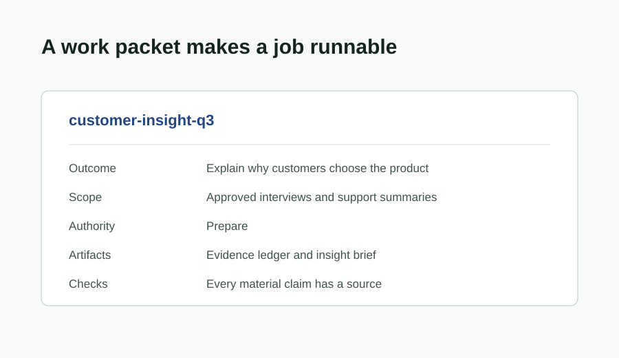
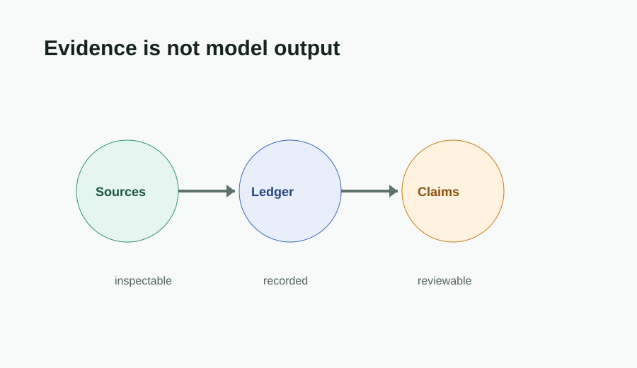
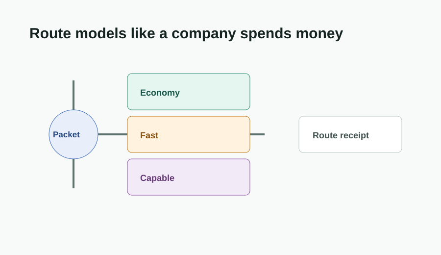
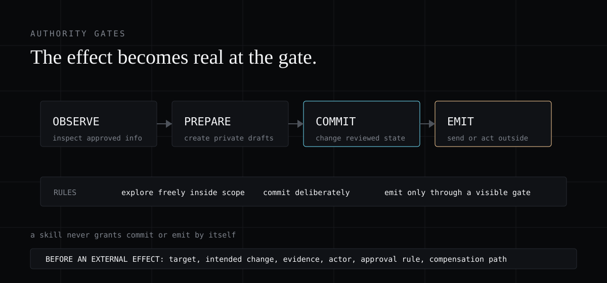
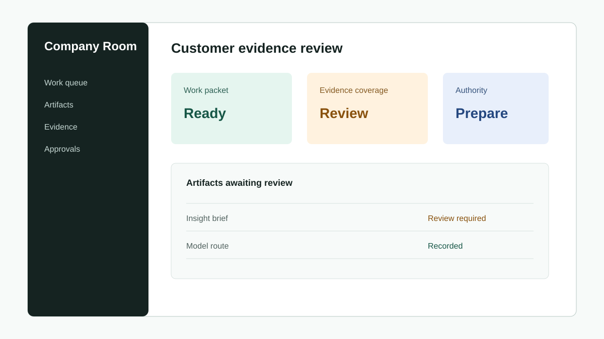
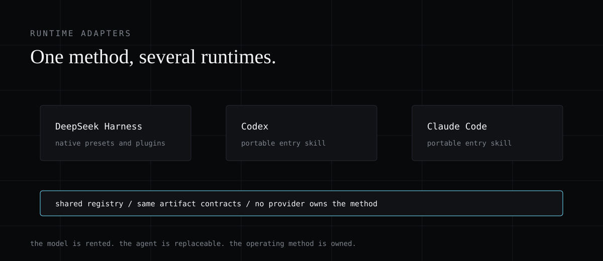

# The Harness Company: How to Build Your First AI-Native Company with Kimi K3

TLDR: If you don't want to read the 3,780 words in this article, you can just go to this [GitHub repo](https://github.com/codejunkie99/company-foundry).

i built the part of an AI company nobody wants to build...

not another agent.

the thing that tells every agent what work matters, what it can see, what it can change, what model it should use, and what it has to leave behind when it is done.

**that thing is the harness.**


## a useful agent is not an organisation

Most teams are moving through the same sequence.

They start with one useful chat. Then they give it a browser.

Then another agent gets access to the repository. Then someone connects a spreadsheet, a CRM, a database, and a handful of model providers.

The demos look insane. Work starts to move faster.

Then someone asks a very boring question.

Where did that customer claim come from?

The answer is often: somewhere in a chat.

That is the whole problem.

A chat can contain good work. **A chat is not a company method.**

A prompt can contain a clever workflow. A prompt is not a durable operating system.

A model setting can choose something smart today. It is not a routing policy that explains cost, speed, quality, and what happens when the model is unavailable.

> the model is rented
>
> the agent is replaceable
>
> the company method is owned

I think this is where most "AI-native company" conversations go wrong.

People picture an organisation made of autonomous personalities. An AI CEO. An AI sales team. An AI product manager. A little org chart of bots talking to each other until the business runs itself.

That is the visible layer. It is not the useful layer.

The useful layer is much less glamorous. It is a system that turns a company question into accountable work.

Why does the work exist? Which customer sources are approved? What is the agent allowed to do? Which model tier fits? What artifact does it owe the next person? Who reviews the result before it changes anything real?

If the system cannot answer those questions, it may be a useful assistant. It is not yet an organisation.

## i wanted to compile a company, not prompt one

The project is called **Company Foundry**.

You describe a company once. Its product. Customers. Goals. Approved sources. Repositories. Applications. Access limits. Budgets. Review rules. What a good artifact looks like.

Then the system turns that into a working company harness.

Not one giant prompt.

Not one agent persona pretending to know the business.

**A portable company specification with the parts a runtime actually needs.**


### three layers, one method

The first layer is the company specification.

It holds identity, customers, active goals, source rules, authority, resources, and standards. This is not a knowledge dump that every model receives. It is the set of records the harness selects from when a task needs them.

The second layer is the method registry.

This is where the company defines its reusable ways of working. How it researches a customer question. How it turns a product decision into a code change. How it builds a dashboard. How it reviews an artifact before it becomes company truth.

The third layer is the runtime adapter.

DeepSeek Harness can consume native presets and scoped skill files. Codex and Claude Code can consume the same operating method through their own skill roots.

A company control plane can consume goals, budgets, approvals, and audit records. A work runtime can consume task and agent configuration.

The company should not be trapped in a chat UI.

That is the point of compiling the method before you pick the interface.

## the company brief is the first artifact

Most people begin by naming an agent.

"You are a world-class researcher." "You are our chief of staff." "You are the best product manager in the world."

That is fun for five minutes.

The more useful question is: what does this company need a worker to know before it can do anything safely?


**The first input to Company Foundry is a company brief.**

It is deliberately structured.

Identity tells the harness what the company sells, who it serves, and which product terms matter. Goals tell it what outcome matters now, not every idea the founder has ever had.

Evidence tells it which sources are approved and which data is restricted. Authority tells it what a worker may observe, prepare, commit, or emit.

Resources tell it which repos, apps, and tools exist. Standards tell it what a finished piece of work must contain.

That gives you a clean answer to a subtle problem.

### select context; do not flood the model

**Company context should be durable. Task context should be selective.**

You do not want every agent to receive every customer note and every access credential. You want a customer-research task to receive the relevant company definition, approved evidence references, appropriate skills, and a tightly scoped permission set.

The agent gets the context it needs for its job. The company keeps the rest under policy.

This also makes change boring in a good way.

If your customer segment changes, update the company brief. If an old source is no longer approved, update its policy. If a new model becomes useful, update the registry. The next relevant task gets the new rule without rewriting twenty agent prompts.

Prompts describe a moment.

Company records describe a method.

## every important job needs a packet

Here is the easiest way to tell whether you have a company method or an agent demo.

Can you write down the job before the model starts?



**I call that record a work packet.**

A work packet names the outcome, owner, scope, inputs, authority, required artifacts, and quality checks. It is not a project plan. It is a bounded unit of work that another worker can inspect, run, review, or resume.

Take customer research.

The bad request is: "research our customers."

The useful request is closer to this:

```text
Question: Why do mid-market operations teams choose us?
Audience: Product and growth leaders
Sources: Approved interviews, support summaries, CRM notes
Authority: Prepare only
Artifact: Evidence ledger and insight brief
Check: Every material claim points to an inspectable source
```

### the packet owns the definition of done

Now the model has a job. The company has a record. A reviewer knows what to inspect.

This is also how you stop AI work from becoming vague performance.

The agent cannot quietly redefine success because the packet owns the outcome.

It cannot pretend a broad brief grants production access because the packet owns authority.

It cannot call a beautiful summary complete if the packet requires source references and a review state.

The packet makes work legible before the model makes it fluent.

## customer research is where the harness becomes real

Customer research is a perfect first workflow because it is useful everywhere and easy to fake.

Every model can create an impressive market summary. Very few systems can show you exactly which customer interviews support its recommendation, what it inferred, what it does not know, and who checked the conclusion before it entered a product decision.



**The research skill runs in four steps.**

First, discovery maps the question. Customer segments. Buying triggers. Product terms. Competitor names. Unknowns. This is coverage work. It may be cheap enough for an economy model.

Second, evidence builds the source ledger. Each source gets an identifier, type, location, access status, date, and the relevant extract. This seems trivial until you try to review a generated brief and discover its best claim came from nowhere.

Third, synthesis compares the evidence and writes the brief. This is where a capable model such as Kimi K3 can be useful. It has a defined question, a bounded source set, and a required structured artifact. It is not being asked to "know the customer" from vibes.

Fourth, review checks the evidence match, sensitive-data rule, claim strength, and recommendation. The result becomes an artifact another team can consume.

> discovery finds the question
>
> evidence proves the claim
>
> synthesis explains the meaning
>
> review protects the company from a confident mistake

### keep facts separate from conclusions

The important rule is almost embarrassingly simple.

**Model output is not a source.**

It can extract, compare, draft, and propose. It does not become company evidence because it sounds clear. The evidence ledger stays separate from the conclusion.

Once you have that, the next workflow gets easier.

The product skill does not need to research the whole company again. It consumes the approved research artifact.

It creates a problem map, a decision brief, and a specification. The build skill consumes the approved specification.

It produces an implementation plan, changed files, checks, and a reviewable delivery record.

That is how company memory compounds.

Not by making one model remember everything.

By giving every important result a place in a chain of evidence and artifacts.

## Kimi K3 is a worker, not the company

The title says Kimi K3 because it is a good way to make the idea concrete.

You can put Kimi K3 in the capable tier for work that needs deep synthesis, difficult code, architecture, or a high-value decision. You can use a faster model for time-sensitive small work. You can use an economy model for extraction, tagging, or broad first-pass coverage.

**The mistake is turning that choice into a dropdown people click at random.**



The router should decide before the work begins.

It reads the work packet. Does this job require structured output? Browser or computer use? A large evidence set? A rapid response? A high-quality conclusion? Then it filters the models that cannot meet the requirement and records the selected tier, reason, and fallback.

### keep a route receipt

The route receipt is tiny:

```yaml
packet: customer-insight-q3
requirements: [cross-source-synthesis, structured-artifact]
preference: quality
selected: Kimi K3
reason: The packet compares evidence across approved sources.
fallback: approved-capable-model, then human review
```

That receipt changes the conversation after a bad result.

Instead of saying "AI got it wrong," the company can inspect the packet, source set, skill version, route, artifact, and review. Maybe the evidence was poor. Maybe the skill was too vague. Maybe the capable model was unnecessary. Maybe the task should have been escalated to a person.

This is what a company needs from model routing.

Not a leaderboard.

A way to explain a trade-off.

## a good harness lets work fail without leaving a mess

**Company logic should not be trapped inside a long agent conversation.**

Real work changes state.

An agent can draft an answer, discover that a source is weak, choose another approach, and start again. That should not leave five half-finished artifacts, three accidental records, and an unclear decision trail behind it.

The harness needs a clean difference between internal exploration and an effect that the company has to live with.

### scope exploration; gate real effects

The easiest mental model is a work scope.

Inside the scope, an agent can read the approved files, create a candidate brief, prepare code in an isolated branch, test a dashboard query, or retry a failed tool call. The scope can be discarded, retried, or reviewed. This is where model work should be flexible.

Outside the scope, the system should be careful.

Writing a CRM update, merging code, charging a card, changing a shared database record, or sending information to a customer changes company or external state.

Before that happens, the system needs a visible proposed effect. What will change? Where? Why? Which packet permits it? What evidence supports it? Who can approve it? Can it be compensated if it goes wrong?

This does not mean the company must make every agent wait for a human.

It means the company decides where it is safe to automate. Some internal changes may be approved in policy. Some public or financial actions may require a person. The difference must be declared before the model begins to act.

That is what makes a harness flexible instead of reckless.

It lets models explore freely where exploration is cheap. It adds a gate where the company creates an obligation.

The loop should converge even when the model changes its mind.

If two research paths reach the same approved artifact, the system should preserve one clear result and its evidence, not make the team untangle every abandoned branch. If a run fails in the middle, the next worker should see where it stopped, not start from a guessed narrative.

Company memory is not every token the model produced.

Company memory is the small set of work records and effects the next person needs to trust.

## the real safety system is authority

**The dangerous part of an agent is not that it writes text.**

The dangerous part is that it can make a change outside itself.

Create a CRM record. Modify production code. Start a paid campaign. Send a customer email. Publish something public. Trigger a third-party workflow.

Those are emissions from the company into the world.



Company Foundry uses four levels of authority.

`observe` lets a worker inspect approved information.

`prepare` lets it produce a draft, a candidate dashboard, or code in an isolated workspace.

`commit` lets it change internal company state.

`emit` lets it act outside the company boundary.

### reversible work and irreversible effects

This is not about making agents slow.

It is how you let them explore quickly without letting them create permanent mess.

An agent can draft ten versions of an email. It can prepare code in a branch. It can make a candidate dashboard. Those are reversible internal actions.

Sending the email is one event. Merging the code is one event. Publishing the dashboard is one event. Changing the roadmap is one decision.

The harness should make that transition visible.

> explore freely inside the work scope
>
> commit deliberately to company state
>
> emit externally through an explicit gate

The model does not choose its own authority. The work packet and runtime policy do.

That is the difference between a bot with tools and a company that can trust its automation.

## skills are not prompt files

The word skill gets used for almost anything now.

Sometimes it means a folder with a good prompt. Sometimes it means a tool. Sometimes it means a model can magically do something.

**For a company, a skill should mean a reusable method with a known input and a known output.**


The Company Foundry registry starts with seven skills.

`company-work-packet` turns a request into bounded work.

`customer-evidence-research` produces a ledger and insight brief.

`model-route-record` selects and records a route.

`company-code-delivery` produces a scoped plan, changed files, and actual test evidence.

`company-ui-artifact` produces a UI brief, information architecture, data contract, state matrix, implementation record, and verification evidence.

`company-dashboard` produces metric definitions, lineage, freshness, permission rules, views, and all of the states a real dashboard needs.

`company-artifact-review` records provenance, uncertainty, and review state.

### artifacts make work inspectable

That last part matters more than it looks.

A chat answer disappears into history. A company artifact has a path. It has inputs. It has a route. It has source references. It has a reviewer. It can be marked draft, review-required, approved, rejected, or superseded.

Now a dashboard can trace back to the research brief that informed it. The research brief can trace back to sources. The source selection can trace back to the work packet. The packet can trace back to a company goal.

You can actually inspect how work became a decision.

## the Company Room is the interface i want

I do not think the first interface should be an animated chart of ten agents talking to each other.

That is a demo interface.

**The first interface should be a Company Room.**



One place where a person can ask a company question and see the accountable system behind the answer.

Why do these customers buy from us? What should we build next? Which work should use Kimi K3? Which artifact is waiting for review? Which claim has weak evidence? Which action is blocked because the worker only has prepare authority?

### a dashboard needs an operating job

The room should show the packet, approved context, skill, route, authority, evidence, artifact, and review state.

This is the real use of a dashboard.

Not a pretty collection of activity metrics.

It is an operating surface for decisions.

The UI skill in the repository makes this concrete. Before an agent builds an interface, it has to name the user, job, primary action, entities, data sources, roles, views, every field's source, and every visible state. Loading. Empty. Partial data. Error. Permission denied. Stale data.

That requirement kills a lot of AI slop before it reaches the screen.

The dashboard skill does the same thing for metrics. A metric needs a definition, source, owner, freshness rule, visibility rule, and path back to the artifact that produced it. A model-generated estimate must be labelled as an estimate, not quietly rendered as company truth.

The artifact is the interface contract.

The dashboard is the company looking at its own work.

## this is why DeepSeek Harness matters

**DeepSeek Harness is not a company operating system.**

It is a good place to start because it treats agent systems as composition. Models, tools, storage, policy, interfaces, and agent behavior are separate capabilities.

A preset can scope which model-facing tools and skills an agent receives. It does not own the global sandbox, permission system, session store, or provider configuration.

### portable method, native runtime

**That is exactly the boundary Company Foundry needs.**



The repository includes two native DeepSeek Harness presets.

`company-research` gives an agent the work-packet, customer-evidence, routing, dashboard, and artifact-review methods.

`company-builder` gives it the work-packet, routing, code-delivery, UI, dashboard, and review methods.

They are intentionally not a secret permission system. They use the harness's real sandbox and permission services. They do not hard-pin Kimi K3. The packet says what the task needs. The registry says which model tiers are allowed. The runtime enforces the model route and authority policy.

Codex and Claude Code get the same method through adapter skills. Their tools are different. The packet, evidence, route, artifact, and review records stay the same.

That makes the company method portable.

The runtime can change. The company does not have to start from zero.

## control planes are not harnesses, and that is fine

**The company does not need one framework to own everything.**

This is where a lot of AI infrastructure projects get needlessly complicated. They try to make one product be the agent runtime, permission system, org chart, goal tracker, budget service, dashboard, browser, model router, and coding environment at the same time.

That produces a large product before it produces one reliable workflow.

### give each layer one job

The better split is simple.

A control plane owns why work exists. It tracks goals, budgets, owners, approvals, and audit. It can answer: should this job exist, who is responsible, and can the company spend on it?

A work runtime owns where the job runs. It knows the agent identity, the machine or sandbox, the task, and the live execution record. It can answer: which worker did this, where did it run, and what happened while it ran?

A harness owns how the work is assembled. It selects context, tools, skills, policy, route, and artifact rules. It can answer: what did this worker receive, what method did it follow, and what must the result contain?

Company Foundry sits above those layers as the compiler.

It begins with one company specification and exports the appropriate form for each layer.

A DeepSeek Harness target gets a native preset, scoped skills, and policy-ready files. A control plane gets roles, goals, budgets, approvals, and work records.

A runtime gets agent and task definitions. Codex and Claude Code get portable operating skills.

No fake integration is required.

If a runtime does not have a native adapter yet, it still receives an implementation specification. That is much better than pretending every product is the same under a different logo.

The company specification is the common language. The adapters are replaceable.

## build the smallest possible AI-native company

Do not begin by creating a fake executive team.

Do not begin by handing an agent every company credential.

Do not begin by making a dashboard of messages.

### start with one closed loop

**Start with one closed loop:**

```text
company brief
  -> customer research packet
  -> approved sources
  -> evidence skill
  -> Kimi K3 route
  -> source-led insight brief
  -> human review
  -> product decision record
```

Make it real.

Use a real company question. Use approved sources. Let the system produce a real artifact. Let a reviewer find something wrong. Fix the skill. Update the packet. Run it again.

Then add the next loop.

Decision brief to product specification. Product specification to code plan. Code plan to reviewed pull request. Pull request to release record. Each loop adds a skill, artifact type, authority boundary, and evaluation only when the company has earned the complexity.

That is how you stay flexible.

Not by giving every model every tool.

By giving every important piece of work a stable path through the company.

The repository is intentionally small because the first job is not to simulate a company.

**The first job is to make one company capability dependable.**

Start with the customer question that already causes confusion. Put the approved evidence in one place. Make the route visible. Demand an artifact. Give a reviewer a real opportunity to reject it. Then ask whether the next workflow can consume that artifact without restarting the research from scratch.

When that works, the company has its first compounding loop.

That is more valuable than another impressive agent demo.

The workers will keep changing.

The company method is what stays.

[Build the first Company Foundry harness here.](https://github.com/codejunkie99/company-foundry)
