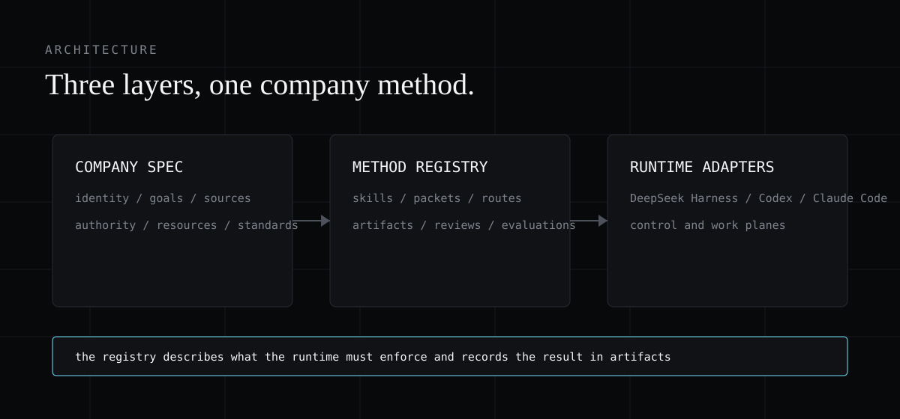

# Architecture



Company Foundry has three layers and one operating loop.

## Company specification

A structured record of identity, goals, source rules, authority, resources, and standards. This is the durable company record. It stays separate from any model conversation so the method does not live inside a giant system prompt.

## Operating-method registry

Versioned skills define work packets, evidence, routes, artifacts, UI, dashboards, and review. Each skill is a company method with an identity, version, owner, trigger, inputs, outputs, tools, source policy, authority, artifacts, stop rules, review rule, and evaluation.

## Runtime adapters

DeepSeek Harness consumes native presets. Codex and Claude Code consume entry skills. A control plane can consume goals, budgets, approvals, and records. A runtime can consume agent and task configuration.

The registry does not replace runtime permissions. It describes what the runtime must enforce and records the result in artifacts.

## The operating loop

```text
company brief -> work packet -> scoped context -> skill -> model route
              -> run -> evidence -> artifact -> review -> decision
```

Each stage leaves a file:

- **Company brief:** identity, goals, evidence, authority, resources, standards.
- **Work packet:** outcome, scope, authority, inputs, outputs, checks.
- **Scoped context:** only the sources, tools, skills, and permissions the packet needs.
- **Skill:** the versioned method used for the run.
- **Model route:** the eligible lane and why it was chosen.
- **Run:** the model-visible context and meaningful events, recorded and resumable.
- **Evidence:** a ledger of sources, claims, confidence, and review state.
- **Artifact:** a durable output with provenance.
- **Review:** a supported decision, material evidence, uncertainty, owner, and state.
- **Decision:** a record the next worker can trace back to evidence.

## Capabilities

Company Foundry adds company capabilities in the same shape DeepSeek Harness uses for its own composition:

- `company-profile` resolves identity, rules, source policy, and scoped context.
- `company-router` selects an eligible model and records why it was chosen.
- `company-skills` loads a versioned method with its templates, tools, and checks.
- `company-evidence` records sources, extracts, claims, confidence, and review state.
- `company-artifacts` creates durable outputs with provenance.
- `company-dashboard` projects packets, approvals, routes, costs, artifacts, and failures.

Every capability defines a stable contract, the provider that implements it, the consumers allowed to request it, the gate that blocks startup when dependencies are missing, the withdrawal and cleanup order, and the inverse operation for each state mutation.

## Planes

No single framework needs to own the whole company. Each plane owns one question:

1. **Control plane:** goals, budgets, approvals, work status, ownership, and audit.
2. **Runtime plane:** worker identity, execution environment, task state, and events.
3. **Composition plane:** DeepSeek Harness assembles context, tools, skills, routes, policy, sessions, and artifacts.
4. **Compiler:** Company Foundry turns the portable company specification into the files each plane needs.

The DeepSeek Harness target receives presets, plugins, skill files, policy, evaluations, and profile patches. The other planes receive the goals, budgets, roles, approvals, tasks, and audit records they own. A new harness receives an implementation specification instead of being forced into a fake integration.
