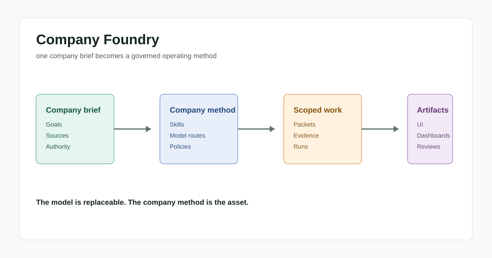
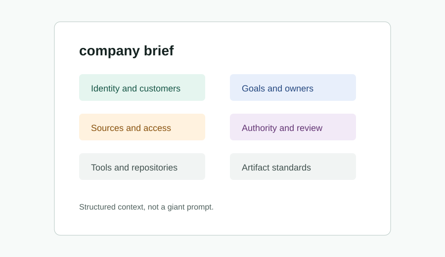
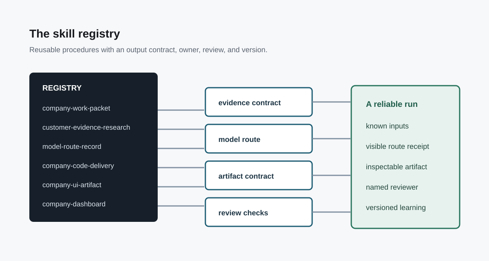
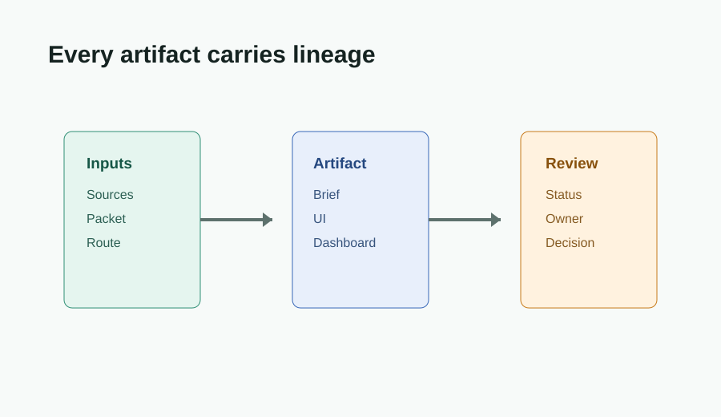
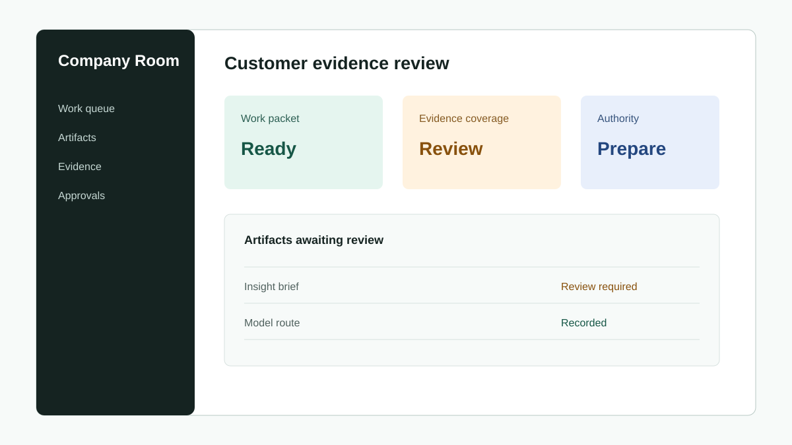
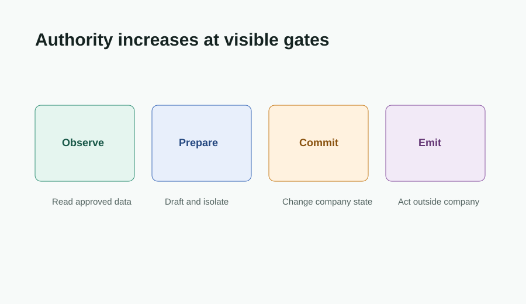
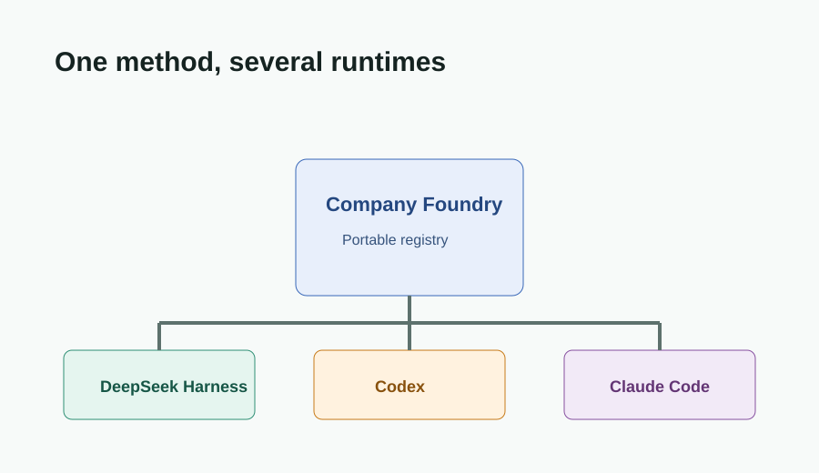
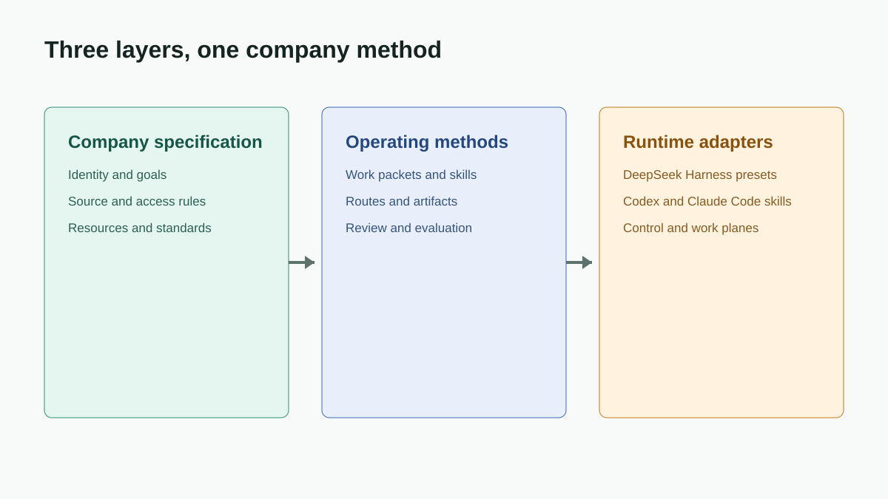

# The Harness Company: How to Build Your First AI-Native Company with Kimi K3

TLDR: If you don't want to read the 4,086 words in this article, you can just go to this [GitHub repo](https://github.com/codejunkie99/company-foundry).

An AI-native company is not a company that bought a chat subscription.

It is not a group chat where five agents play at being a management team. It is not a dashboard that turns ordinary work into coloured boxes. And it is definitely not an autonomous CEO that is allowed to make decisions nobody can explain.

**An AI-native company is a company whose recurring work has been made executable.** A request arrives, the system finds the relevant context, chooses a suitable model, records what it did, produces an artifact, and asks the right person for the right decision.

That sounds modest. It is a much bigger change than it first appears.

Most companies already have the ingredients: documents, repositories, customer conversations, spreadsheets, analysts, designers, engineers, and approval steps. The problem is that these ingredients do not form a reliable system. Knowledge lives in people. Process lives in memory. Important decisions are rediscovered each time work changes hands.

Language models make that weakness visible because they can move through information faster than the organisation can coordinate it. The model is not the organisational innovation. The harness around the model is.

This is a practical design for that harness. It uses Kimi K3 as a capable-model example, but it is deliberately not built around one provider. The durable object is a portable company operating method: a small set of skills, presets, records, authority gates, and artifacts that can run in a harness today and survive a model change tomorrow.

## The problem is not intelligence

When people first add AI to a company, they often start with a question like: which model should we use?

That is a reasonable procurement question. It is not the first design question.

The first question is: **what is the unit of work that this company needs to complete repeatedly, with evidence and a named owner?** Until that is clear, a more capable model just creates more plausible output at a higher speed.

Consider a normal product request: “Research why mid-market customers stop using onboarding after the first week, recommend a fix, build the dashboard, and share a plan.”

This single sentence hides five different jobs. Someone needs to define the customer segment. Someone needs to locate interviews, support tickets, usage data, and prior decisions. Someone needs to separate evidence from interpretation. Someone needs to write code and make an interface that helps a person decide. Someone needs authority to change production behaviour.

In an ordinary organisation, the work passes through meetings. In an AI-native organisation, the hand-offs should become explicit objects.

The first object is the company brief. It is not a grand strategy memo. It is a compact statement of what matters now:

- the outcome to change;
- the customer or operating context;
- the available evidence and the missing evidence;
- constraints such as budget, policy, deadline, and systems of record;
- an accountable human owner;
- the decision that must be made at the end.

**A brief gives the model a boundary, not a personality.** It tells the system what success means and, just as importantly, what it may not assume.

This is why “give every department an agent” is a weak starting point. Departments are broad and durable. Work packets should be narrow and inspectable. A good packet can be run, reviewed, retried, compared, and stopped. A department-shaped prompt cannot.

## Start with a closed loop

The company harness should turn a brief into a closed loop:

1. define the work;
2. gather evidence;
3. select the capability and authority needed;
4. create a useful artifact;
5. review the artifact and record the decision;
6. use the result to improve the next packet.

The loop matters because output is not the same as completed work. A beautiful research memo that cannot show its sources is not complete. A working pull request with no stated customer problem is not complete. A dashboard with no action attached is not complete.

The work packet is the smallest useful interface between a company and an agent. It contains the brief, inputs, permitted tools, skill names, selected model route, authority level, expected artifacts, reviewer, and stopping rule.

That might look like extra administration. In practice, it removes the expensive kind of ambiguity. A person opening a packet should be able to answer four questions quickly: what is being attempted, why does it matter, what evidence is allowed, and who gets to decide what happens next?

**The harness should make work legible before it makes work automatic.** This is the difference between an operating system and a collection of clever demos.

There is a useful test here. Imagine a new operator, a new model, and a new team lead looking at the same packet. Could all three reconstruct the task without asking the original author? If not, the organisation has not captured the work yet.

## Customer research needs a company memory

Customer research is a good first workload because it exposes every weakness in the system.

The naive version asks a model to “research this company” from the web. It comes back with a clean summary, a list of competitors, and a confident point of view. The result may be useful. It may also be a polished version of the wrong problem.

Company-level research needs two kinds of context. The first is external: market structure, public positioning, alternatives, news, pricing, category language, and observable product behaviour. The second is internal: calls, tickets, win and loss notes, product usage, sales notes, retention data, experiments, and decisions that are not visible on the internet.

**The internal record is what makes the research company-specific.** Without it, the system is performing category research, not customer research.

The customer-evidence-research skill should require a claim ledger. Each material claim records its source, date, scope, confidence, and whether it is observed fact or interpretation. The system should say “we do not know” when the evidence is absent.

For example, a research packet may contain a support export, ten interview transcripts, funnel events, and a public competitor page. The output should not flatten these into a single voice. It should keep the facts distinct: three customers used the same phrase; fourteen accounts left this step; the competitor claims a different outcome; the conclusion is a hypothesis, not a finding.

That discipline changes the quality of decisions. It makes it possible to challenge a recommendation without discarding the work. It also means a later agent can revisit the claim when new evidence arrives.

The research artifact should end with a decision frame, not just observations:

- What seems true now?
- What would change our view?
- Which customer group is affected?
- What action is proposed?
- Who must approve that action?

**Research becomes valuable when it shortens a responsible decision.** The purpose is not to create a larger archive of summaries.

## Use a router, not a favourite model

Every company will use more than one model. This is not a temporary inconvenience. It is the normal condition of an AI-native organisation.

Some tasks need inexpensive extraction across hundreds of files. Some need a quick response while a customer waits. Some need sustained reasoning over a complicated plan, a difficult codebase, or conflicting evidence. Some need a model that works with a specific tool or data boundary.

The answer is not to make every worker choose a model by instinct. The harness needs a model router.

At the simplest level, the router has three lanes:

- **economy** for classification, extraction, deduplication, and first-pass triage;
- **fast** for interactive work, quick iterations, and routine execution;
- **capable** for difficult reasoning, complex code changes, high-stakes synthesis, and work that needs a careful review trail.

Kimi K3 can sit in the capable lane when the task benefits from its particular strengths. That is useful, but it is not a company architecture. The packet should request a capability, not pledge loyalty to a model.

The router should return a route receipt. It records the selected provider and model, reasoning setting, tool permissions, budget, fallback, and reason for the choice. If the router degrades to a different model, the receipt should say so.

**A route receipt turns model choice into an observable engineering decision.** It lets a team compare cost, speed, and result quality by task type instead of arguing from anecdotes.

This also gives the company a graceful way to change. A provider can become unavailable, expensive, slow, or less suitable. If the work packet says “use this exact model,” the workflow stops. If it says “needs capable reasoning, repository tools, and a cost ceiling,” the router can adapt without hiding the change.

## Skills are procedures with an output contract

People use the word “skill” too loosely. A long prompt is not automatically a skill.

A useful company skill is a versioned procedure with clear inputs, steps, artifact expectations, review checks, and stop conditions. It is small enough to understand and specific enough to reuse.

The initial registry does not need hundreds of skills. It needs a few that match the company loop:

1. `company-work-packet` turns an outcome into bounded work.
2. `customer-evidence-research` produces a cited claim ledger and decision frame.
3. `model-route-record` selects a route and writes the receipt.
4. `company-code-delivery` plans, changes, tests, and documents a code artifact.
5. `company-ui-artifact` turns a decision or workflow into a usable interface.
6. `company-dashboard` creates an operating view with metrics, definitions, owners, and next actions.
7. `company-artifact-review` checks evidence, quality, permissions, and hand-off completeness.

The registry should answer questions that a prompt library usually ignores: who owns this skill, what inputs does it expect, what can it create, what review is mandatory, and where is it allowed to run?

**The skill is the company’s reusable judgement, written down as an executable procedure.** It should carry the organisation’s standards forward without pretending that judgement has disappeared.

This is also how code and application work become first-class. A code-delivery skill should not stop at “implement the feature.” It should require a stated user outcome, acceptance checks, test evidence, a change record, and a hand-off note. A dashboard skill should not stop at a chart. It should state the metric definition, data freshness, owner, intended decision, and failure mode.

## Artifacts must outlive the chat

The weakest form of agent work lives only in a conversation window.

That is acceptable for brainstorming. It is not acceptable for company memory. A company needs artifacts that can be inspected without replaying a chat: a research brief, a decision record, a pull request, an interface preview, a dashboard, an experiment plan, or a customer account review.

Each artifact should carry lineage. It should point to the work packet, the evidence used, the model route, the skill version, the reviewer, and the resulting decision. It does not need to be verbose. It needs to be findable.

This is where UI artifacts and dashboards matter. A company should not treat them as decorative output from an agent. They are decision surfaces.

A customer-risk dashboard, for example, should show the measure, the time window, the cohort, the data freshness, the owner, and the action it supports. A generated product interface should show the scenario it was designed for, the state it handles, and the acceptance checks it passed.

**An artifact is a contract between the work that happened and the person who must act on it.** If the artifact cannot support action, it is not finished.

The Company Room is a practical way to collect these artifacts. It is not another strategy board. It is an operational view of active packets: what is in progress, what evidence has arrived, which model route was used, what artifact exists, which review is waiting, and what decision is blocked.

The interface can be generated by Codex or another coding environment when the skill has a clear artifact contract. The important point is not which computer-use tool creates the page. The important point is that the generated page has a defined job in the company loop.

## Authority is a product feature

The most dangerous error in AI-native organisation design is confusing access with authority.

An agent may be able to read a repository, query a CRM, open a browser, create a draft, and prepare a deployment. None of that means it should be allowed to send a customer email, change a price, merge a release, or move money.

**Authority should be explicit, narrow, and visible in the packet.** A simple ladder is enough to begin:

- `observe`: inspect permitted systems and produce analysis;
- `prepare`: create drafts, branches, queries, and proposed artifacts;
- `commit`: make a reversible change inside an approved boundary;
- `emit`: send or publish externally.

The default should be `prepare`. This is where most useful work happens anyway. The model can research, write, code on a branch, generate an interface, and assemble a decision packet without creating an irreversible external consequence.

Importantly, a skill cannot grant itself more authority. The execution environment owns the permission boundary. The skill can ask for a transition; a policy and, where required, a human owner approves it.

This makes the system less magical and more trustworthy. A reviewer does not have to guess whether an agent acted. The packet, artifact lineage, and authority record show what happened.

## A harness is not a control plane

There are now several categories of multi-agent products. Some coordinate projects, repositories, and long-running tasks. Some manage agent teams. Some offer an interface for assigning work and tracking status. Those are useful control planes.

A harness has a different job. It defines how a particular work packet is executed: which skills are available, how context is assembled, which tools can run, what model route is selected, and what evidence is preserved.

The company operating method sits above both. It should be able to compile its work into a harness without being trapped inside it.

That is why the registry uses adapters. The same skill contract can be expressed in DeepSeek Harness as a preset and component configuration. It can be exposed to Codex or Claude Code as a skill file. It can produce artifacts that a project control plane indexes and displays.

**The portable asset is not the UI. It is the procedure, evidence contract, authority rule, and artifact lineage behind the UI.** Interfaces can change. Providers can change. The company should keep its operating knowledge.

For DeepSeek Harness, two presets are enough to make this concrete. `company-research` gives the agent a narrow evidence and review toolset. `company-builder` adds code, UI, and dashboard delivery skills. Neither preset needs to promise a fully autonomous company. They provide bounded environments for particular classes of work.

This is also why a company harness should not compete with every agent framework. It should make the organisation’s method portable across them.

## Build the first version from one real workflow

Do not begin by modelling the whole company. That produces a decorative organisation chart and a large surface area for permission mistakes.

Choose one workflow that has these properties: it happens at least twice a month, it needs evidence from more than one place, it results in an artifact, and a human already makes a recurring decision at the end.

Customer onboarding, renewal risk, product-discovery synthesis, incident follow-up, and technical due diligence are good candidates. They have a clear customer or operating outcome, real inputs, and a recognisable decision point.

Start with this sequence:

1. **Write the brief.** Name the outcome, owner, audience, evidence sources, constraints, and decision.
2. **Define one work packet.** Specify inputs, tools, authority, selected skills, stop condition, and review owner.
3. **Run the research skill.** Require claim-level evidence and make unknowns visible.
4. **Route by task.** Use the economy lane for preparation, the fast lane for iteration, and Kimi K3 or another capable lane for the difficult synthesis.
5. **Create one artifact.** It might be a decision memo, product brief, pull request, or dashboard. Make it something that changes the next human action.
6. **Review the artifact.** Check correctness, evidence, policy, and completeness before escalating authority.
7. **Keep the receipt.** Record what worked, which route was used, what it cost, and what should change in the next run.

**The first success is not an autonomous workflow. It is a workflow that becomes easier to trust the second time.**

That standard keeps the project honest. The system should earn wider authority through repeatable evidence, not through a dramatic demo.

## What to measure in the first ninety days

Traditional software metrics are not enough. A harness can produce output quickly while quietly increasing review load, confusion, or operational risk.

Measure whether the work packet makes decisions faster and better. Track cycle time from brief to reviewed artifact. Track the proportion of claims with traceable sources. Track acceptance and rework rates. Track route cost and latency by task type. Track how often a reviewer changes the final recommendation.

**The useful metric is decision quality per unit of organisational effort.** Cheap output that nobody trusts is expensive. A slower capable-model pass may be a bargain if it prevents three rounds of rework.

Also measure where humans intervene. Intervention is not a failure. It is a map of where the company’s judgement is concentrated. Those points may remain human-owned forever, or they may reveal a new skill contract that needs to be made more precise.

After several runs, the company will learn what its real work is. It may discover that research is easy but evidence access is poor. It may discover that code generation is fast but product acceptance criteria are vague. It may discover that the expensive model is only necessary for one short synthesis step.

That is the right kind of learning. It improves the operating method rather than merely tuning a prompt.

## The failure modes are organisational

Most harness projects fail for ordinary reasons. They fail because the work is vague, the data is inaccessible, the reviewer does not trust the output, or the artifact lands in a place where nobody uses it. Better prompting does not fix these failures.

The first failure is turning a role into an agent before defining the work. “Build a sales agent” sounds specific until you ask what it is permitted to do. Does it research accounts, enrich a list, draft outreach, update the CRM, negotiate price, or send messages? These are different packets with different evidence requirements and different authority levels.

**Name the action, not the job title.** A narrow account-research packet can earn trust. A broad sales agent usually hides five unresolved policies inside a friendly label.

The second failure is treating retrieved context as true context. A system can have access to every document and still make bad decisions if it cannot distinguish current policy from old policy, a customer quote from an internal opinion, or a metric definition from a dashboard label. Retrieval needs selection rules, dates, provenance, and a way to show what was excluded.

The third failure is using review as a ceremonial last step. If a reviewer receives a long answer with no claim ledger, no source links, and no stated decision, the review becomes a second research task. That does not create safety. It creates duplicated work.

**Good review changes the shape of the work before it reaches the reviewer.** The packet should ask for the exact evidence, alternatives, risks, and approval needed for this decision.

The fourth failure is building an attractive control room before there is anything worth controlling. A visual layer is useful once packets produce consistent artifacts. Before that, it becomes a status display for ambiguous work. Start with the records and make the dashboard earn its place.

The fifth failure is centralising every model decision in a platform team. A shared router is useful. A bottleneck is not. Teams should be able to request an economy, fast, or capable route in a declared budget and policy boundary. The shared system then provides defaults, evaluation data, and fallbacks.

Finally, avoid automatic expansion. A successful internal research packet does not imply that an external publishing packet should receive `emit` authority. Each authority transition should be separately justified. The fact that a model can perform an action is evidence of capability, not evidence of permission.

## Give the harness an operating cadence

The company harness should be tended like any other operational system. Skills need owners. Presets need versioning. Metrics need definitions. A model route that was sensible last quarter may be slow, costly, or poorly suited today.

This does not require a large governance function. It requires a small cadence that makes changes visible.

Once a week, review the packets that were blocked, rejected, or unusually expensive. Look for the first broken boundary. Was the brief unclear? Was required evidence unavailable? Did the route choose the wrong capability tier? Did the artifact fail its acceptance test? Did the reviewer lack enough context to decide?

Once a month, review the registry itself. Retire duplicate skills. Merge procedures that actually share a contract. Version skills whose inputs or review checks have changed. Examine where workers constantly rewrite instructions by hand; that is usually a missing skill or a poorly designed brief.

**A registry is alive when it becomes smaller and more precise over time.** Growth is not the goal. Fewer reliable procedures are more valuable than a catalogue nobody can choose from.

Once a quarter, evaluate the router against representative work packets. Compare quality, latency, cost, tool reliability, and reviewer corrections. Include at least one task where the fast lane should win and one task where the capable lane should win. This protects the company from the common habit of benchmarking models on entertaining prompts rather than its real work.

There should also be a simple incident path. If an agent writes to the wrong system, leaks restricted context, makes an unsupported claim, or takes an action outside authority, the response is not “the AI made a mistake.” The response is to freeze the relevant preset, preserve the packet and records, identify the policy or tool boundary that failed, and ship a constrained fix.

That is what makes the harness operational rather than theatrical. The company learns from normal work and from failure without losing the ability to inspect what happened.

## The company is the harness

The phrase “AI-native company” can encourage a fantasy: agents in every function, constant autonomy, no friction, no people in the loop.

The practical version is more interesting. It is a company that can describe its recurring work clearly enough for humans and models to carry it out together. It treats customer evidence as a shared asset. It makes model choice observable. It gives artifacts a lineage. It keeps authority explicit. It turns good judgement into procedures without pretending that procedures are judgement itself.

The product is not a dashboard, a prompt library, or an agent that claims to run the business. **The product is an executable organisational design.**

Build one work packet. Make it honest. Keep the evidence, route receipt, artifact, and review. Then run it again.

That is how a company becomes AI-native: not when it has the most agents, but when its work can survive contact with a new model, a new operator, and a real decision.
